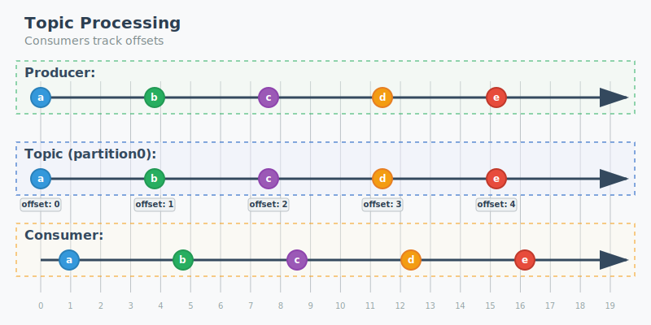

# Event-Driven Design With Kafka

**Joey Brown**
_Date: September 16, 2025_


---

# What is Apache Kafka?

- **Distributed streaming platform**
- **High-throughput, low-latency** messaging system
- **Fault-tolerant** and **scalable**
- Originally developed by **LinkedIn**

---

# For What is Kafka Used?

- Real-time **Analytics**
- System **Integration**
- **Event Sourcing**
- Stream **Processing**

---

# Example - Reactive Systems


---

# Kafka Development

- Created by **LinkedIn** 2010 - Real time data feeds
  - Solution to **batch processing latency**
- Graduated **Apache Software Foundation** Incubator in 2012
- **Confluent** is made up of orginal developers. Major contributor, platform, tool provider. Publicly traded.

---

# How does Kafka work?

- Systems produce records
- Kafka persists records
- Systems consume records

---

# General Flow


---

# Event Processing vs Messaging

**Messaging** - Publisher/Subscriber

- "Process this request"
- "Remove this item from inventory"

**Eventing** - Producer/Consumer

- "This request was just received"
- "This product was just purchased"

---

# Distributed Systems

Specialized Services

Tradeoffs

> "First law of distributed computing: Don't distribute your computing!"

David Heinemeier Hansson (DHH) 2014

---

# Core Concepts

- **Producers** - Send events to topics
- **Consumers** - Read events from topic partitions
- **Brokers** - Accept and serve events
- **Events/Records** - Facts about the system
- **Topics** - Categories for organizing events
- **Partitions** - Persist events and dictate how it is consumed

---

# Events/Records

Immutable, ordered fact about something that happened.

```
{
  key: "patient_id_0x0D15EA5E",
  value: {
    patient_id: "0x0D15EA5E",
    action_type: "missed_appointment",
    appointment_id: "0x290427349"
  },
  timestamp: 1694738160000,
  headers: [
    {
      key: "trace_id",
      value: "0xDEADBEEF"
    }
  ]
}
```

---

# Topics

Category of records. Groups of related facts.

- Patient activity in a healthcare system
- Orders in a retail system
- Package lifecycle events in a parcel delivery system

---

# Topics

- Topics are typically owned by one producer
- Typically have one or more consumer

- Decoupled from Service Implementation, Coupled to Record Keeping

---

# Messaging/Eventing System Broker Types

**Smart Broker/Dumb Consumer**

- RabbitMQ
- NATS Jetstream
- Redis

**Dumb Broker/Smart Consumer**

- Kafka
- Azure Event Hub

---

# Topic Processing Visualization



---

# Partitions

Scalability

How the events are persisted on disk

Ordering of messages

- OrderID
- PatientID
- ParcelID

---

# Brief Review

- Records
- Topics
- Partitions

---

# Single Partition Processing Visualization


---

# Multiple Partition Processing


---

# Distributed Systems - Time is Relative

- Passage of time depends on observer's frame of reference
- Partitions are the frame of reference
- Partition Keys

---

# Multiple Partition Processing


---

# Consumer Groups

- Offsets
- Consumer Group Offsets
- **Partitions** put upper bound on number of **consumers** for a **topic**

---

# Consumer Lag

- **Consumer Group Offset** vs **Most Recent Offset**
- _How far behind the consumer is from real-time data_
- Eventual Consistency

---

# High Availability

- Durability and Record Persistance in Kafka

---

# What makes Kafka hard to use?

- Service ownership
- Observability
- Event loss remediation
- Topic versioning, Event versioning
- Capacity planning

---

# Questions

https://kafka.apache.org/documentation/

**Contact:** brownjn12@gmail.com
