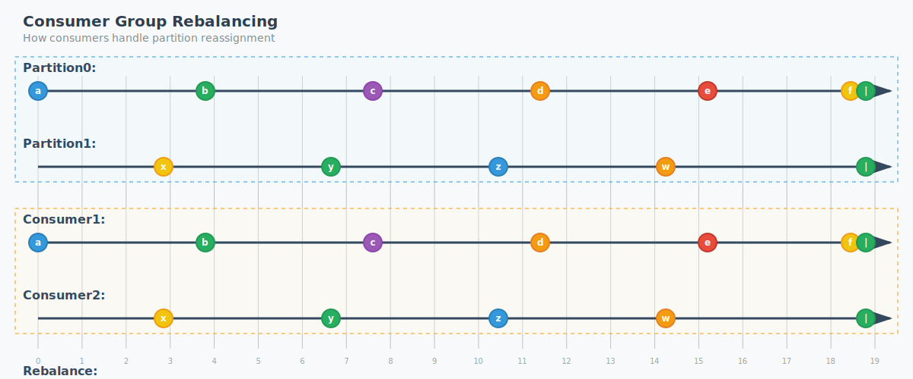

# Event-Driven Design With Kafka

**Joey Brown**
_Date: September 16, 2025_

---

# What is Apache Kafka?

- **Distributed streaming platform**
- **High-throughput, low-latency** messaging system
- **Fault-tolerant** and **scalable**
- Originally developed by **LinkedIn**

---

# Where is Kakfa Used?

- Real-time **Analytics**
- System **Integration**
- **Event Sourcing**
- Stream **Processing**

---

# Why is Kakfa?

- Created by LinkedIn 2010 - Real time data feeds
- Essentially solution to **batch processing latency**
- Graduated Apache Software Foundation Incubator in 2012

---

# Event Processing vs Messaging

**Messaging** - Publisher/Subscriber

- "Process this request"
- "Remove this item from inventory"

**Eventing** - Producer/Consumer

- "This request was just recieved"
- "This product was just purchased"

---

# Messaging/Eventing System Broker Types

Smart Broker/Dumb Consumer

- RabbitMQ
- NATS Jetstream
- Redis

Dumb Broker/Smart Consumer

- Kafka
- Azure Event Hub

---

# How it works

How does kafka work?

How do producers publish events?

How do consumers consume events?

---

# General Flow

---

# Key Concepts

## Core Components

- **Producers** - Send messages to topics
- **Consumers** - Read messages from topics
- **Brokers** - Store and serve messages
- **Topics** - Categories for organizing messages
- **Partitions** - Topics are split into partitions

---

# Topics

Category of events

- Orders in a retail system
- Patient percriptions in a healthcare system
- Package lifecycle events in a parcel delivery system

---

# Partitions

How the events are persisted on disk (partition key)

Dictates how events are consumed (guarantees order)

- OrderID
- PatientID
- ParcelID

Topic partitions are independently configured

---

# Partition Processing Visualization

**Single Partition Flow** - Messages flow through one partition in order

---

# Multiple Partition Processing

**Load Distribution** - Messages distributed across multiple partitions for parallel processing

---

# Consumer Group Rebalancing

**Dynamic Scaling** - How consumers handle partition reassignment when group membership changes

---

# Backpressure Handling

**Rate Control** - How consumers handle high message rates with buffering

---

# Important Considerations

- Service ownership
- Observability
- Event loss remediation
- Topic versioning, Event versioning
- Capacity planning

## Resources

- [Official Documentation](https://kafka.apache.org/documentation/)
- [Apache Kafka on Heroku](https://devcenter.heroku.com/articles/kafka-on-heroku)

---

# Questions?

Thank you for your attention!

**Contact:** your.email@example.com
